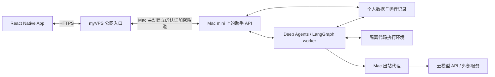
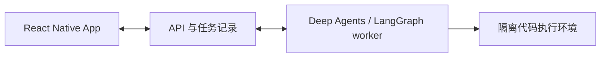

# 架构讨论稿

状态：2026-09-22，客户端初始化阶段。下述后端、运行时和沙盒均未实现。

## 已确认方向

- 使用独立 Git 仓库，以 React Native 创建新 App，重新讨论架构。
- 产品定位为服务用户本人的真正个人助手。
- 第一阶段优先服务器执行，App 虚拟执行环境后续再扩展。
- 后端优先采用 Deep Agents / LangGraph 或同类成熟技术。
- 后续需要与其他 harness 交互并编排它们；第一阶段不实现该能力。
- 用户于 2026-09-22 提供的主机计划：先在 myVPS 运行；已购买的 Mac mini 到货后放在公司常驻运行，
  通过内网穿透连接 myVPS，并在 Mac 上配置对外访问代理。Mac 内存为 16GB，具体设备与网络尚未验收。
- 主模型只调用云 API；本地仅考虑极轻量模型。
- Chat 模型接入支持三套协议：OpenAI 兼容的 Chat Completions、OpenAI Responses、Gemini 原生协议。
- 记忆以写入、整理、获取三个过程为主线，进一步区分该记什么、怎么记。
- Work 的长期方向是基于拓扑关系管理模型与智能体工作；外部 harness 编排仍留作后续扩展。

初始化采用 Expo + TypeScript。此选择负责客户端工具链，不决定后端语言或智能体框架。

## 个人助手的产品边界

第一版场景、单助手多会话、三类模型分工与初始化流程由[产品讨论稿](PRODUCT.md)统一描述。
实现建议按单用户自托管设计，围绕个人长期上下文、资料、事项与行动建立统一体验。
记忆内容、生命周期和检索规则由[个人助手记忆讨论稿](MEMORY.md)统一描述；事项有状态，委托有结果和失败回执。
代码执行是完成任务的一种工具。

长期常驻的是服务和调度器。第一版由用户请求和已配置的定时任务发起委托，不实现外部事件 Trigger。
内部数据处理与记忆整理按需要执行，不持续空跑智能体循环。通知围绕已委托任务与用户偏好设计。
LangGraph checkpoint 用于执行恢复，不能直接充当完整的个人记忆、事项库或用户档案。
常驻主机能解除任务对手机前台和笔记本开机的依赖；运行中断、云 API 故障、重复执行和恢复仍需单独验证。

## 主机分工与迁移建议

推荐让完整助手服务与权威数据位于同一主机，myVPS 长期承担公网入口。以下为建议部署拓扑，尚未实施。

| 归属 | myVPS 过渡阶段 | Mac mini 常驻阶段 |
| --- | --- | --- |
| App 域名、HTTPS 与公网入口 | myVPS | myVPS，保持 App 接入地址稳定 |
| 助手 API、任务 worker、调度器 | myVPS | Mac mini，同机不同进程 |
| 个人资料、记忆、事项、checkpoints 与工作文件 | myVPS 的持久存储 | Mac mini 的持久存储，保持一份权威数据 |
| 代码执行 | myVPS 上隔离执行 | Mac 上经选定虚拟化/沙盒方案隔离执行 |
| 模型推理 | 云 API | 云 API；Mac 上的出站代理按服务配置 |
| 备份 | 独立备份位置待定 | 可向 myVPS 保存加密备份，并验证可恢复性 |

公网访问隧道与 Mac 对外代理分别负责入站、出站路径。隧道候选可用 frp，具体方案待网络验收确定；
必须验证对端身份与加密，不把私有运行时、数据库、Shell 或容器管理端口直接公开。
模型客户端、浏览器与沙盒进程分别验证代理是否生效，不假设桌面代理自动覆盖所有服务。

该拓扑中 Mac 离线会使助手 API 暂时不可用。App 应保留本地草稿、展示连接状态，不能把网关收到请求当作任务已持久接收。
若要求 Mac 离线时仍能接收任务，再评估在 VPS 增加持久入口队列。第一阶段不做双活、自动接管或双向数据库同步。

迁移时先停止旧主机接收新任务与调度，排空或明确中断在途运行，再转移数据库、checkpoints、工作文件与产物。
在新主机重新安装匹配架构的依赖，验证原有任务、记忆和产物后切换网关；只有一个主机运行调度器和 worker。
回退必须处理切换后的新写入，不能直接启用旧数据副本。

## 16GB 主机的资源与执行策略

建议从一个活动执行任务、一个并发代码沙盒开始；交互聊天保持可用，记忆整理优先在执行空闲时运行。
浏览器和文档处理按需启动，空闲执行实例回收。
工作文件和已确认的个人数据持久保存，依赖通过锁文件或镜像重建，不把保留文件等同于保留进程状态。
实际内存上限、CPU 配额和并发量在到货后用真实任务验证。

主模型在云端推理，Mac 的性能主要服务本地工具、浏览器、文件处理和检索；不据此承诺云端模型生成速度。
本地 embedding、分类等轻量能力仅在明确需要时增加，不预先部署模型服务。

Mac 上的 Linux 容器需要 Linux 虚拟机层；镜像与原生依赖需按目标架构构建，myVPS 的 CPU 架构部署前核实。
若轻量模型需要 Apple GPU，评估 macOS 原生推理服务并通过受控接口调用；普通 Linux 容器不作为自动获得 Metal 加速的假设。
通用代码沙盒不默认访问全部 Mac 个人目录、钥匙串或公司内网；额外目录和网络能力通过持久授权配置开放。
项目工作目录外的访问是首版支持范围，默认工作目录不等于唯一授权目录。

## 建议的职责划分

| 部分 | 建议职责 | 边界 |
| --- | --- | --- |
| App | 输入、会话、任务进度、结果展示与本地缓存 | 手机断线或关闭不应中断服务器任务 |
| API 与持久化 | 身份验证、会话、运行状态、事件记录、产物引用 | 不在请求处理进程直接执行模型生成的代码 |
| 智能体运行时 | 调用模型、选择工具、处理工具结果、取消与恢复任务 | 工具调用经过参数、权限和执行目标检查 |
| 代码执行环境 | 执行 Python、Node、Shell，产出文件和运行回执 | 独立文件系统边界、资源限制与网络策略 |

初版建议保持一个后端代码库，API 与任务 worker 分进程运行；先不拆多个业务服务。
数据库保存任务状态与有序事件，客户端重连按序号补齐；代码产物保存为文件，通过引用访问。
建议后端首选 Python，具体 API 框架、数据库和沙盒提供方待下一轮确定。

## Deep Agents 接入建议

[Deep Agents](https://docs.langchain.com/oss/python/deepagents/overview) 是使用 LangGraph 运行时的 agent harness，
提供文件工具、上下文管理、子智能体等能力。第一版直接使用其能力，在一个运行时模块中封装 SDK 调用。

- App 使用产品自己的会话 ID、运行 ID、状态、事件和产物契约；不直接消费 LangGraph checkpoint 或内部消息对象。
- [Checkpointer](https://docs.langchain.com/oss/python/langgraph/persistence) 保存会话执行状态；跨会话数据使用 store。
  生产使用持久化实现，内存 saver 只用于开发。持久化 checkpoint 不等于保存沙盒进程、已安装依赖或全部工作文件。
- [StateBackend](https://docs.langchain.com/oss/python/deepagents/backends) 是会话状态中的虚拟文件系统；
  它本身不提供 Linux Shell。代码执行通过 [sandbox backend](https://docs.langchain.com/oss/python/deepagents/sandboxes) 接入。
- 优先评估现有 sandbox 集成。宿主机上的 `LocalShellBackend` 不提供隔离，不作为服务端任意代码执行的默认方案。
- 是否开启任务规划、内置子智能体和长期记忆按产品需求确定，不因为框架提供就全部启用。

运行状态、客户端事件和 LangGraph 内部状态各有归属，需要定义一致性和恢复策略；选定框架不等于这些产品语义自动完成。

## 模型接入协议

2026-09-22 确定三协议接入范围，Gemini 是用户正在使用的服务。以下为后端接入设计，尚未安装 SDK 或实现调用。

| 协议 | 接入用途 | 建议实现 |
| --- | --- | --- |
| OpenAI 兼容 Chat Completions | OpenAI 及兼容该格式的服务，支持自定义 API 地址与模型 ID | 使用 `langchain-openai` 的 `ChatOpenAI`，显式选择 Chat Completions |
| OpenAI Responses | 原生 Responses 条目、工具调用与多轮续接 | 使用 `ChatOpenAI` 的 `use_responses_api=True`，保留所需条目与续接信息 |
| Gemini 原生 | 直接使用 Gemini 的消息、工具调用与多模态格式 | 使用 `langchain-google-genai` 的 `ChatGoogleGenerativeAI`；先按 Developer API 设计，实际端点接入时确认 |

协议、服务端点和模型分别配置，不根据模型名称猜测协议。配置最少包含协议、API 地址、模型 ID、
服务端凭据引用和必要的模型参数；允许同一服务端点配置多个模型或协议。密钥保留在服务端，App 只引用模型配置。
聊天、执行和记忆整理三种职责分别引用模型配置，职责选择不改变协议处理与能力校验规则。
第一版直接复用现有 LangChain 集成，在运行时模块集中选择模型，不额外部署模型网关或编写通用 SDK 框架。

三套协议统一映射到产品自己的文本增量、工具执行进度、结果、用量与错误事件。运行时保留 SDK 的完整消息和
必要的协议元数据，不能仅从 App 展示文本重建下一轮请求：

- Responses 的 `output` 包含不同类型的条目；工具调用和回传通过 `call_id` 关联。采用本地历史或服务端
  response ID 续接时都要保留所需上下文，产品任务记录不能仅依赖供应商的会话 ID。
- Gemini 的 thought signature 随原消息保留和回传；持久化、流式聚合、上下文整理后仍需验证续接。
  签名作为不透明协议数据处理，不进入个人记忆或跨供应商传递。
- 模型切换发生在完整回合边界；跨协议时由可移植内容重新构建上下文，不能沿用另一供应商的签名或 response ID。
  有未完成工具调用时先处理该运行，不承诺任意时刻无损切换。

能力按“端点 + 协议 + 模型”验证，分别标明工具调用、图片输入、结构化输出与推理参数等支持情况。
OpenAI 兼容不意味着所有扩展字段都兼容：`ChatOpenAI` 不保留部分第三方推理字段，实际使用的服务若依赖这些字段，
优先采用其现有专用集成；其协议归属仍是 Chat Completions 或 Responses。缺少必要能力时给出明确提示，
不静默丢弃工具或切换协议。供应商托管搜索、代码执行等内置工具按实际需求单独接入。

接入验收至少覆盖每套协议的流式文本、工具调用参数聚合、工具结果回传后的继续回答，以及保存和恢复后的多轮续接。
工具参数未完整且未校验时不执行；一个模型回合完成不等于整个任务完成。另需验证取消、限流与断流回执，
重试不能重复执行已有副作用的工具；供应商未返回用量时标为未知。图片、结构化输出等仅对声明支持的配置验收。
Gemini 应列入首批真实服务验收，SDK 可用或模拟响应通过均不等于用户实际端点已经验证。

## 代码执行的关键约束

智能体运行时负责作出下一步决策，沙盒负责实际运行代码。智能体能调用 Shell，不意味着能直接管理宿主机。

- 每个项目有持久工作目录；执行实例与持久文件分离。同项目任务可复用文件，写同一目标时需处理并发冲突。
- 工作目录以外的内容可通过获准的路径访问：沙盒显式挂载额外目录，或由宿主工具在授权范围内操作。
  读写范围、实际目标和工具回执可追溯；已覆盖的操作沿用授权，不逐次重复询问。
- 执行有时限、CPU/内存/进程数限制，以及明确的网络出口策略。
- 通用沙盒不默认挂载宿主机根目录、容器管理 socket、业务数据库或服务凭据。
  服务器操作若需要宿主能力，单独明确该任务可用的工具与目标，不能因跨目录文件访问自动提升权限。
- 回执至少包含执行 ID、退出状态、输出和产物引用；模型描述不能替代真实回执。
- 超时和取消应终止对应执行进程；进程崩溃后需处理在途调用，不能盲目重放有副作用的操作。
- 容器只是候选实现。多用户或不可信代码需要评估 gVisor、虚拟机或托管沙盒等隔离方式。

## 后续扩展

外部 harness 通过独立接入模块映射到产品运行模型：启动、接收进度、交互输入、取消、结果与产物。
届时再处理父子任务、不同 harness 的能力差异与工作空间访问。第一版不编写通用适配器基类、插件注册中心或跨引擎调度器。
Deep Agents 的内置子智能体和外部 harness 编排不是同一项能力。

Work 拓扑建议以任务和运行实例为中心，表示委派、父子与依赖关系，并关联模型、harness、执行主机及工作空间。
模型是运行实例使用的推理能力，不能替代运行实例的身份与状态。任务已转移到常驻主机且所需资源可用时，
笔记本关闭后才可以继续执行；依赖仅存在于笔记本的进程或文件时，仍需先迁移或同步这些资源。
首版保留必要的任务与运行身份，不提前实现多 harness 调度平台。

App 内部内容可以通过工具接口操作。手机内脚本沙盒和远端模拟器则属于独立运行环境，需另行明确需求。
移动端后台任务受系统调度和终止约束，不能承诺强制唤醒任意代码持续运行。第一阶段不实现这些扩展。

## 下一步讨论

1. 确定后端 API、持久化、调度与沙盒组合，以及额外路径授权如何落地；项目文件长期保留的方向已确定。
2. 选择首批研究来源、文件格式与实际任务样例，落实聊天、执行、记忆整理的模型配置和预算。
3. 确定 Android TTS、设备接入与通知方案，以及定时任务错过执行时间时的处理规则。
4. 是否要求 Mac 离线期间继续提交任务尚未单独确认；建议先以清晰的不可用状态和本地草稿处理。
5. 用 [PRODUCT.md](PRODUCT.md) 和 [MEMORY.md](MEMORY.md) 的样例验收初始化、研究/文件委托及记忆质量。

第一条建议验收链路：初始化人格 → 探索执行环境 → 聊天提交研究或文件任务 → 服务器执行 → App 展示产物。
同时覆盖长期会话、断线重连、失败与取消；暂不迁移旧数据。

## 官方参考

- [React Native 新项目建议](https://reactnative.dev/docs/environment-setup)
- [Expo SDK 57](https://docs.expo.dev/versions/v57.0.0/)
- [Deep Agents 与 LangGraph 的关系](https://docs.langchain.com/oss/python/deepagents/overview)
- [Deep Agents 文件后端](https://docs.langchain.com/oss/python/deepagents/backends)
- [Deep Agents 代码执行沙盒](https://docs.langchain.com/oss/python/deepagents/sandboxes)
- [LangGraph 状态持久化](https://docs.langchain.com/oss/python/langgraph/persistence)
- [OpenAI Chat Completions 与 Responses 的消息、工具和续接差异](https://developers.openai.com/api/docs/guides/migrate-to-responses)
- [LangChain OpenAI 接入与第三方兼容边界](https://docs.langchain.com/oss/python/integrations/chat/openai)
- [LangChain Gemini 接入与 thought signature 保留](https://docs.langchain.com/oss/python/integrations/chat/google_generative_ai)
- [Gemini 原生内容生成 API](https://ai.google.dev/api/generate-content)
- [移动端后台任务的系统调度与停止边界](https://docs.expo.dev/versions/v57.0.0/sdk/background-task/)
- [Docker Engine 安全边界](https://docs.docker.com/engine/security/)
- [gVisor 隔离模型](https://gvisor.dev/docs/)
- [frp 反向代理与部署模式](https://github.com/fatedier/frp)
- [frp TLS 与对端校验](https://gofrp.org/en/docs/features/common/network/network-tls/)
- [Docker Desktop 的 Linux 虚拟机层](https://docs.docker.com/desktop/features/vmm/)
- [跨 CPU 架构的容器镜像](https://docs.docker.com/build/building/multi-platform/)
- [Docker Desktop 容器 GPU 支持范围](https://docs.docker.com/desktop/features/gpu/)
