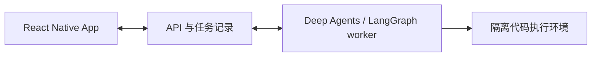

# 架构讨论稿

状态：2026-09-22，客户端初始化阶段。下述后端、运行时和沙盒均未实现。

## 已确认方向

- 使用独立 Git 仓库，以 React Native 创建新 App，重新讨论架构。
- 第一阶段优先服务器执行，App 虚拟执行环境后续再扩展。
- 后端优先采用 Deep Agents / LangGraph 或同类成熟技术。
- 后续需要与其他 harness 交互并编排它们；第一阶段不实现该能力。

初始化采用 Expo + TypeScript。此选择负责客户端工具链，不决定后端语言或智能体框架。

## 建议的职责划分

| 部分 | 建议职责 | 边界 |
| --- | --- | --- |
| App | 输入、会话、任务进度、结果展示与本地缓存 | 手机断线或关闭不应中断服务器任务 |
| API 与持久化 | 身份验证、会话、运行状态、事件记录、产物引用 | 不在请求处理进程直接执行模型生成的代码 |
| 智能体运行时 | 调用模型、选择工具、处理工具结果、取消与恢复任务 | 工具调用经过参数、权限和执行目标检查 |
| 代码执行环境 | 执行 Python、Node、Shell，产出文件和运行回执 | 独立文件系统边界、资源限制与网络策略 |

初版建议保持一个后端代码库，API 与任务 worker 分进程运行；先不拆多个业务服务。
数据库保存任务状态与有序事件，客户端重连按序号补齐；代码产物保存为文件，通过引用访问。
建议后端首选 Python，具体 API 框架、数据库和沙盒提供方待下一轮确定。

## Deep Agents 接入建议

[Deep Agents](https://docs.langchain.com/oss/python/deepagents/overview) 是使用 LangGraph 运行时的 agent harness，
提供文件工具、上下文管理、子智能体等能力。第一版直接使用其能力，在一个运行时模块中封装 SDK 调用。

- App 使用产品自己的会话 ID、运行 ID、状态、事件和产物契约；不直接消费 LangGraph checkpoint 或内部消息对象。
- [Checkpointer](https://docs.langchain.com/oss/python/langgraph/persistence) 保存会话执行状态；跨会话数据使用 store。
  生产使用持久化实现，内存 saver 只用于开发。持久化 checkpoint 不等于保存沙盒进程、已安装依赖或全部工作文件。
- [StateBackend](https://docs.langchain.com/oss/python/deepagents/backends) 是会话状态中的虚拟文件系统；
  它本身不提供 Linux Shell。代码执行通过 [sandbox backend](https://docs.langchain.com/oss/python/deepagents/sandboxes) 接入。
- 优先评估现有 sandbox 集成。宿主机上的 `LocalShellBackend` 不提供隔离，不作为服务端任意代码执行的默认方案。
- 是否开启任务规划、内置子智能体和长期记忆按产品需求确定，不因为框架提供就全部启用。

运行状态、客户端事件和 LangGraph 内部状态各有归属，需要定义一致性和恢复策略；选定框架不等于这些产品语义自动完成。

## 代码执行的关键约束

智能体运行时负责作出下一步决策，沙盒负责实际运行代码。智能体能调用 Shell，不意味着能直接管理宿主机。

- 每个工作空间使用显式分配的目录；执行实例与持久文件分离，跨任务是否共享需明确。
- 执行有时限、CPU/内存/进程数限制，以及明确的网络出口策略。
- 沙盒不获得宿主机根目录、容器管理 socket、业务数据库或服务凭据。
- 回执至少包含执行 ID、退出状态、输出和产物引用；模型描述不能替代真实回执。
- 超时和取消应终止对应执行进程；进程崩溃后需处理在途调用，不能盲目重放有副作用的操作。
- 容器只是候选实现。多用户或不可信代码需要评估 gVisor、虚拟机或托管沙盒等隔离方式。

## 后续扩展

外部 harness 通过独立接入模块映射到产品运行模型：启动、接收进度、交互输入、取消、结果与产物。
届时再处理父子任务、不同 harness 的能力差异与工作空间访问。第一版不编写通用适配器基类、插件注册中心或跨引擎调度器。
Deep Agents 的内置子智能体和外部 harness 编排不是同一项能力。

App 内部内容可以通过工具接口操作。手机内脚本沙盒和远端模拟器则属于独立运行环境，需另行明确需求。
移动端后台任务受系统调度和终止约束，不能承诺强制唤醒任意代码持续运行。第一阶段不实现这些扩展。

## 下一步讨论

1. 第一版服务器环境：每次任务临时创建，还是长期保留文件和依赖的工作空间？
2. 沙盒提供方：自部署还是托管服务？先根据运行时长、文件持久性与资源需求选择。
3. 使用范围：单用户自部署还是多用户服务？这决定身份、存储和沙盒隔离要求。

第一条建议验收链路：App 提交任务 → 服务器运行 → 沙盒生成文件 → App 展示产物；覆盖断线重连、失败与取消。

## 官方参考

- [React Native 新项目建议](https://reactnative.dev/docs/environment-setup)
- [Expo SDK 57](https://docs.expo.dev/versions/v57.0.0/)
- [Deep Agents 与 LangGraph 的关系](https://docs.langchain.com/oss/python/deepagents/overview)
- [Deep Agents 文件后端](https://docs.langchain.com/oss/python/deepagents/backends)
- [Deep Agents 代码执行沙盒](https://docs.langchain.com/oss/python/deepagents/sandboxes)
- [LangGraph 状态持久化](https://docs.langchain.com/oss/python/langgraph/persistence)
- [移动端后台任务的系统调度与停止边界](https://docs.expo.dev/versions/v57.0.0/sdk/background-task/)
- [Docker Engine 安全边界](https://docs.docker.com/engine/security/)
- [gVisor 隔离模型](https://gvisor.dev/docs/)
