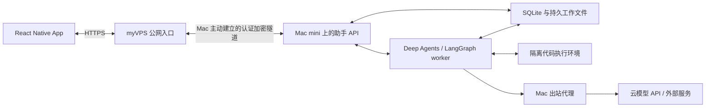
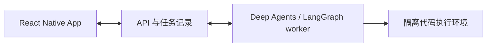

# 架构讨论稿

状态：2026-09-28，首条会话/任务/文件链路已实现；当前能力和验收边界以[后端说明](../backend/README.md)为准。
本文描述长期设计与选择依据，不能将尚未接入的沙盒、文件图片记忆和编排目标视作现有能力。手机布局处于样板房阶段。

## 已确认方向

- 使用独立 Git 仓库，以 React Native 创建新 App，重新讨论架构。
- 产品定位为服务用户本人的真正个人助手。
- 第一阶段优先服务器执行，App 虚拟执行环境后续再扩展。
- 后端优先采用 Deep Agents / LangGraph 或同类成熟技术。
- 后端与存储前期保持轻量，优先 SQLite；出现实际容量、性能或部署瓶颈后再评估 PostgreSQL。
- 持久任务调度与跨目录执行参考 Codex harness 的行为和权限边界，具体实现适配本项目。
- 后续需要与其他 harness 交互并编排它们；第一阶段不实现该能力。
- 用户于 2026-09-28 确认的主机分工：当前在 myVPS 过渡；Mac mini 到货并验收后在公司常驻运行助手服务和数据，
  通过隧道连接 myVPS 公网入口。myVPS 为 2C2G，不承担新知行的长期主服务。Mac 内存为 16GB，具体设备与网络尚未验收。
- 主模型只调用云 API；本地仅考虑极轻量模型。
- Chat 模型接入支持三套协议：OpenAI 兼容的 Chat Completions、OpenAI Responses、Gemini 原生协议。
- 记忆以写入、整理、获取三个过程为主线，进一步区分该记什么、怎么记。
- Work 的长期方向是管理模型与智能体工作；外部 harness 编排仍留作后续扩展。新仓库不以旧知行服务为基础，个别连接按实际需求单独决定。

初始化采用 Expo + TypeScript。此选择负责客户端工具链，不决定后端语言或智能体框架。

## 个人助手的产品边界

第一版场景、单助手多会话、三类模型分工与初始化流程由[产品讨论稿](PRODUCT.md)统一描述。
实现建议按单用户自托管设计，围绕个人长期上下文、资料、事项与行动建立统一体验。
记忆的轻量写入、整理和获取由[个人助手记忆讨论稿](MEMORY.md)统一描述；事项有状态，委托有结果和失败回执。
代码执行是完成任务的一种工具。

产品交互遵循[产品原则](PRODUCT.md#产品原则)：模型承担理解与整理，不把原话引用、逐条财务对账或内部状态机推给用户。数据库中的任务回执、权限检查和资源引用仍按实际操作记录；这些后台约束不自动生成额外的用户步骤。

长期常驻的是服务和调度器。第一版由用户请求和已配置的定时任务发起委托，不实现外部事件 Trigger。
内部数据处理与记忆整理按需要执行，不持续空跑智能体循环。通知围绕已委托任务与用户偏好设计。
LangGraph checkpoint 用于执行恢复，不能直接充当完整的个人记忆、事项库或用户档案。
常驻主机能解除任务对手机前台和笔记本开机的依赖；运行中断、云 API 故障、重复执行和恢复仍需单独验证。

## 主机分工与迁移建议

推荐让完整助手服务与权威数据位于同一主机，myVPS 长期承担公网入口。以下为建议部署拓扑，尚未实施。

| 归属 | myVPS 过渡阶段 | Mac mini 常驻阶段 |
| --- | --- | --- |
| App 域名、HTTPS 与公网入口 | myVPS | myVPS，保持 App 接入地址稳定 |
| 助手 API、任务 worker、调度器 | myVPS | Mac mini，同机不同进程 |
| 个人资料、记忆、事项、checkpoints 与工作文件 | myVPS 的持久存储 | Mac mini 的持久存储，保持一份权威数据 |
| 代码执行 | Linux 上按授权范围执行，沙盒接入待验证 | macOS 上按授权范围执行，沙盒接入待验证 |
| 模型推理 | 云 API | 云 API；Mac 上的出站代理按服务配置 |
| 备份 | 独立备份位置待定 | 可向 myVPS 保存加密备份，并验证可恢复性 |

公网访问隧道与 Mac 对外代理分别负责入站、出站路径。隧道候选可用 frp，具体方案待网络验收确定；
必须验证对端身份与加密，不把私有运行时、数据库、Shell 或容器管理端口直接公开。
模型客户端、浏览器与沙盒进程分别验证代理是否生效，不假设桌面代理自动覆盖所有服务。

该拓扑中 Mac 离线会使助手 API 暂时不可用。App 保留本地草稿并展示连接状态，不能把网关收到请求当作任务已持久接收。Mac 离线时不接收任务；不在 2C2G 的 VPS 上增加第二套助手、持久入口队列、双活或双向数据库同步。

迁移时先停止旧主机接收新任务与调度，排空或明确中断在途运行，再转移数据库、checkpoints、工作文件与产物。
在新主机重新安装匹配架构的依赖，验证原有任务、记忆和产物后切换网关；只有一个主机运行调度器和 worker。
回退必须处理切换后的新写入，不能直接启用旧数据副本。

## 16GB 主机的资源与执行策略

建议从一个活动执行任务、一个并发代码沙盒开始；交互聊天保持可用，记忆整理优先在执行空闲时运行。
浏览器和文档处理按需启动，空闲执行实例回收。
工作文件和已确认的个人数据持久保存，依赖通过锁文件或镜像重建，不把保留文件等同于保留进程状态。
实际内存上限、CPU 配额和并发量在到货后用真实任务验证。

主模型在云端推理，Mac 的性能主要服务本地工具、浏览器、文件处理和检索；不据此承诺云端模型生成速度。
本地 embedding、分类等轻量能力仅在明确需要时增加，不预先部署模型服务。

Mac 上的 Linux 容器需要 Linux 虚拟机层；镜像与原生依赖需按目标架构构建，myVPS 的 CPU 架构部署前核实。
若轻量模型需要 Apple GPU，评估 macOS 原生推理服务并通过受控接口调用；普通 Linux 容器不作为自动获得 Metal 加速的假设。
通用代码沙盒不默认访问全部 Mac 个人目录、钥匙串或公司内网；额外目录和网络能力通过持久授权配置开放。
项目工作目录外的访问是首版支持范围，默认工作目录不等于唯一授权目录。

## 建议的职责划分

| 部分 | 建议职责 | 边界 |
| --- | --- | --- |
| App | 输入、会话、任务进度、结果展示与本地缓存 | 手机断线或关闭不应中断服务器任务 |
| API 与持久化 | 身份验证、会话、运行状态、事件记录、产物引用 | 不在请求处理进程直接执行模型生成的代码 |
| 智能体运行时 | 调用模型、选择工具、处理工具结果、取消与恢复任务 | 工具调用经过参数、权限和执行目标检查 |
| 代码执行环境 | 执行 Python、Node、Shell，产出文件和运行回执 | 独立文件系统边界、资源限制与网络策略 |

初版建议保持一个后端代码库，API 与任务 worker 分进程运行；先不拆多个业务服务。
数据库保存任务状态与有序事件，客户端重连按序号补齐；代码产物保存为文件，通过引用访问。
当前后端使用 Python、FastAPI、独立 worker 与 SQLite；macOS/Linux 的命令沙盒仍需接入和验收。
初版不引入 Redis、独立消息队列或分布式工作流平台。交互聊天与执行任务分别分配运行容量，
不能因唯一的执行槽位被长任务占用，就阻塞聊天、接收引导或取消请求。

## SQLite 持久化方案

以下为单用户、单台活动主机的持久化设计；已落地部分与兼容处理见[后端说明](../backend/README.md#数据与权限边界)。

| 数据 | 初版保存方式 |
| --- | --- |
| 会话、消息、个人记忆、项目与文件索引 | 产品 SQLite 表，明确版本与迁移记录 |
| 任务、运行、待处理输入、定时计划、进度事件与工具回执 | 产品 SQLite 表；接收成功以事务提交为准 |
| LangGraph 执行状态 | 评估官方 SQLite checkpointer，由 SDK 管理其存储格式 |
| 原始附件、工作文件、生成产物 | 本机持久目录；资源库复用文件与必要元数据，不另建媒体服务 |

SQLite 位于 API 与 worker 所在主机的本地磁盘；Mac 与 VPS 不通过隧道共享一个可写数据库文件。
建议使用 WAL、短写事务、连接级外键校验与有限锁等待；模型调用、网络请求和文件处理不放在数据库事务里。
[SQLite WAL](https://sqlite.org/wal.html) 允许读写并行，但同一时刻仍只有一个写入者，且要求所有访问进程在同一主机。
接收回执涉及的写入应验证持久化配置，初版优先 `synchronous=FULL`；不能只设置 WAL 就承诺断电不丢已接收任务。
部署时核验 Python 实际链接的 SQLite 版本，采用已修复 WAL-reset 问题的版本（3.51.3 或后续维护版本，
或官方明确包含修复的回移版本），不只检查 Python 包版本。

[LangGraph 的 SQLite saver](https://reference.langchain.com/python/langgraph/checkpoints) 面向轻量使用，
官方并不将其推荐为通用生产方案。这里按单用户自托管范围评估，接入前验证并发聊天、单任务执行及崩溃恢复。
产品事务与 SDK checkpoint 不能假设原子提交；通过运行 ID、输入 ID、checkpoint ID 和工具回执对齐恢复位置，
区分已持久接收、已纳入执行和已产生副作用。SQLite saver 不满足验收时再调整实现，不能用内存 saver 替代持久化。

备份使用 [SQLite Backup API](https://sqlite.org/backup.html) 等一致性备份方式；运行中的 `.db` 文件不能单独裸复制。
跨产品数据、checkpoint 与工作文件的完整备份需要共同恢复边界，初版可短暂停止接收与执行后制作备份，
记录文件清单并做恢复验证。迁往 Mac 时按前述停写迁移流程整体转移，保留未消费的 Queue 与待处理运行。

升级 PostgreSQL 的判断依据是持续锁等待、写入吞吐、查询/维护成本、多个主机同时写入或可用性要求，
不预设某个记录数或文件大小就是上限。现在保留清晰的数据模型、稳定 ID 与可验证的迁移脚本即可；
不预建两套数据库实现或通用存储框架。检索先使用本机能力，中文与语义检索方案按记忆样例验收后选定。

## 持久任务调度与 Codex 参考边界

参考 [Codex App Server](https://learn.chatgpt.com/docs/app-server) 的会话、运行、事件、引导和中断语义，
以及[定时任务](https://developers.openai.com/codex/app/automations)的后台运行与结果记录体验。
这些公开接口不能证明其内部使用某种数据库或调度算法；下述 SQLite 调度是知行自身的设计。
Deep Agents / LangGraph 仍负责模型与工具循环，第一版不接入 Codex 进程或外部 harness 编排。

定时计划决定何时生成任务，持久队列决定任务何时执行，LangGraph checkpoint 决定从哪一步恢复。
三者通过任务与运行 ID 关联；进程常驻和会话历史本身都不能代替任务恢复。

1. 用户输入先写入 SQLite，再返回接收回执；同一消息的网络重试沿用原 ID，不创建重复输入。
2. worker 中唯一的调度循环读取到期计划。生成待执行记录和推进下一执行时间在同一事务中完成，
   对计划 ID 与计划触发时刻建立唯一约束，避免重启后重复生成同一次委托；保存时区与计划版本。
3. worker 原子领取待执行记录，保留运行和尝试标识；同一运行只由一个执行者推进。
   单机先限制为一个 worker 实例，无需提前实现分布式租约服务；重启接管前确认旧实例及其子进程状态。
4. 正常步骤记录进度、checkpoint 和工具执行回执。服务启动后找回待处理与中断的运行，
   可重入步骤继续执行，副作用结果不确定的操作先核对或等待处理，不能把整个任务无条件重跑。
5. Queue 保留接收顺序；Steer 绑定当前运行并区分接收与应用。参照 Codex 的 `expectedTurnId` 校验目标，
   运行结束后的迟到引导不能进入下一次运行。取消走独立控制路径，已取消任务不会在重启时复活。

建议定时计划明确目标会话/项目；目标会话忙时进入该会话的 Queue，不自动作为 Steer。
周期任务错过多个时点时建议合并为一次补跑，同一计划未完成时不重叠执行；一次性任务与过期时间另行设置。
这些为默认策略建议，需用具体定时任务样例确认，不默默补跑大量历史任务。

系统进程管理器负责服务异常退出后的重启；worker 负责从持久状态恢复任务。手机连接与任务生命周期无关。
首轮验收覆盖：接收后立即重启、定时触发中断后重启、工具完成而 checkpoint 未完成、Queue/Steer 重复送达、
取消与完成同时发生、子进程仍在运行时的恢复，以及 App 重连后进度与产物一致。

## Deep Agents 接入建议

[Deep Agents](https://docs.langchain.com/oss/python/deepagents/overview) 是使用 LangGraph 运行时的 agent harness，
提供文件工具、上下文管理、子智能体等能力。第一版直接使用其能力，在一个运行时模块中封装 SDK 调用。

- App 使用产品自己的会话 ID、运行 ID、状态、事件和产物契约；不直接消费 LangGraph checkpoint 或内部消息对象。
- [Checkpointer](https://docs.langchain.com/oss/python/langgraph/persistence) 保存会话执行状态；跨会话数据使用 store。
  生产使用持久化实现，内存 saver 只用于开发。持久化 checkpoint 不等于保存沙盒进程、已安装依赖或全部工作文件。
- [StateBackend](https://docs.langchain.com/oss/python/deepagents/backends) 是会话状态中的虚拟文件系统；
  它本身不提供 Linux Shell。代码执行通过 [sandbox backend](https://docs.langchain.com/oss/python/deepagents/sandboxes) 接入。
- 优先评估现有 sandbox 集成。宿主机上的 `LocalShellBackend` 不提供隔离，不作为服务端任意代码执行的默认方案。
- 产品子智能体配置保存在 SQLite；会话以 `agent_id` 绑定直接交谈对象，主知行只可委派配置中的命名助手。Deep Agents 默认的 `general-purpose` 被覆盖并在运行时拒绝调用；每个助手只接收其配置允许的物理工具，额外目录仍受服务端授权约束。
- 是否开启任务规划和长期记忆按产品需求确定，不因为框架提供就全部启用。

运行状态、客户端事件和 LangGraph 内部状态各有归属，需要定义一致性和恢复策略；选定框架不等于这些产品语义自动完成。

### 运行中输入与控制

Queue / Steer 的用户语义由 [PRODUCT.md](PRODUCT.md#queue-与-steer) 统一定义。建议在产品后端持久接收输入，
记录消息 ID、会话、目标任务/运行、发送意图与接收顺序；客户端重试以消息 ID 去重，回执能在重连后查询。
执行运行由单个 worker 串行写入其状态，避免 API 请求与 worker 并发改写同一个 LangGraph checkpoint。

- Queue 在当前完整运行结束后消费下一条输入；一轮中的模型响应结束或工具完成不等于队列可以推进。
  暂停、失败与取消的处理遵循产品语义，不把队列待处理记录等同于新任务已执行。
- Steer 在模型调用前和新工具启动前检查。若旧模型调用返回时已有新引导，先纳入新要求并重新决策，
  避免直接执行依据旧要求生成、尚未启动的工具调用；已启动工具保留真实结果或取消回执，不能伪造回滚。
  消息 ID 与对应 checkpoint 的消费记录需要一致，确保中断恢复不丢失或重复应用引导。
- 引导绑定实际执行的运行。主助手委托执行模型后，不能只让聊天模型答复“收到”便标为已应用；
  运行已结束、目标不匹配或无法应用时返回明确状态。不会跨会话猜测目标或自动转交下一运行。
- 取消走独立控制路径，在工作步骤间检查，并按工具能力终止在途进程；回执区分取消请求与实际停止。

[LangGraph interrupts](https://docs.langchain.com/oss/python/langgraph/interrupts) 支持在指定位置暂停并用外部输入恢复，
恢复时所在节点会重新执行；引导消息不能简单等同于 `Command(resume=...)`，已有副作用要通过回执与幂等处理避免重放。
[Deep Agents 的 Queue / Steer 讨论](https://github.com/langchain-ai/deepagents/issues/1390) 可参考其意图区分，
该讨论不能当作已选 SDK 版本具备完整服务端实现的证明。第一版不依赖某个模型协议独有的实时注入能力。

## 模型接入协议

2026-09-22 确定三协议接入范围，Gemini 是用户正在使用的服务。SDK 接入及 checkpoint 续接已实现和测试；
百炼新加坡兼容端点于 2026-09-23 完成真实调用验收，其他用户实际端点仍需分别验证。

| 协议 | 接入用途 | 建议实现 |
| --- | --- | --- |
| OpenAI 兼容 Chat Completions | OpenAI 及兼容该格式的服务，支持自定义 API 地址与模型 ID | 使用 `langchain-openai` 的 `ChatOpenAI`，显式选择 Chat Completions |
| OpenAI Responses | 原生 Responses 条目、工具调用与多轮续接 | 使用 `ChatOpenAI` 的 `use_responses_api=True`，保留所需条目与续接信息 |
| Gemini 原生 | 直接使用 Gemini 的消息、工具调用与多模态格式 | 使用 `langchain-google-genai` 的 `ChatGoogleGenerativeAI`；先按 Developer API 设计，实际端点接入时确认 |

协议、服务端点和模型分别配置，不根据模型名称猜测协议。配置最少包含协议、API 地址、模型 ID、
服务端凭据引用和必要的模型参数；允许同一服务端点配置多个模型或协议。密钥保留在服务端，App 只引用模型配置。
聊天、执行和记忆整理三种职责分别引用模型配置，职责选择不改变协议处理与能力校验规则。
第一版直接复用现有 LangChain 集成，在运行时模块集中选择模型，不额外部署模型网关或编写通用 SDK 框架。

三套协议统一映射到产品自己的文本增量、工具执行进度、结果、用量与错误事件。运行时保留 SDK 的完整消息和
必要的协议元数据，不能仅从 App 展示文本重建下一轮请求：

- Responses 的 `output` 包含不同类型的条目；工具调用和回传通过 `call_id` 关联。采用本地历史或服务端
  response ID 续接时都要保留所需上下文，产品任务记录不能仅依赖供应商的会话 ID。
- Gemini 的 thought signature 随原消息保留和回传；持久化、流式聚合、上下文整理后仍需验证续接。
  签名作为不透明协议数据处理，不进入个人记忆或跨供应商传递。
- 模型切换发生在完整回合边界；跨协议时由可移植内容重新构建上下文，不能沿用另一供应商的签名或 response ID。
  有未完成工具调用时先处理该运行，不承诺任意时刻无损切换。

能力按“端点 + 协议 + 模型”验证，分别标明工具调用、图片输入、结构化输出与推理参数等支持情况。
OpenAI 兼容不意味着所有扩展字段都兼容：`ChatOpenAI` 不保留部分第三方推理字段，实际使用的服务若依赖这些字段，
优先采用其现有专用集成；其协议归属仍是 Chat Completions 或 Responses。缺少必要能力时给出明确提示，
不静默丢弃工具或切换协议。供应商托管搜索、代码执行等内置工具按实际需求单独接入。

接入验收至少覆盖每套协议的流式文本、工具调用参数聚合、工具结果回传后的继续回答，以及保存和恢复后的多轮续接。
工具参数未完整且未校验时不执行；一个模型回合完成不等于整个任务完成。另需验证取消、限流与断流回执，
重试不能重复执行已有副作用的工具；供应商未返回用量时标为未知。图片、结构化输出等仅对声明支持的配置验收。
Gemini 应列入首批真实服务验收，SDK 可用或模拟响应通过均不等于用户实际端点已经验证。

## 代码执行与跨目录权限

智能体运行时负责作出下一步决策，沙盒负责实际运行代码。智能体能调用 Shell，不意味着能直接管理宿主机。
参考 [Codex sandboxing](https://learn.chatgpt.com/docs/sandboxing)：默认工作位置、允许的文件读写范围、
网络权限与申请扩大权限分别管理；约束覆盖执行的命令及其子进程，不仅覆盖内置文件工具。
本机 Codex CLI 0.153.4 的帮助已验证 `--add-dir`、工作目录与 sandbox 配置选项，未据此假定 Deep Agents 自动提供等价能力。

- 每个项目有持久工作目录；执行实例与持久文件分离。同项目任务可复用文件，写同一目标时需处理并发冲突。
- 工作目录以外的内容通过持久授权访问，按目录指定只读或可写，并将该次运行实际使用的授权记入回执。
  例如项目工作区可写、资料目录只读、导出目录可写。已覆盖的操作沿用授权，超范围访问单独申请或明确拒绝。
- 原生沙盒将额外路径纳入操作系统策略，容器则显式挂载；不因跨目录需求默认开放整个宿主机。
  路径校验应处理真实路径与符号链接，Shell 及派生进程仍由系统边界约束，不能只靠模型提示词或路径字符串检查。
- 执行有时限、CPU/内存/进程数限制，以及明确的网络出口策略。
- 通用沙盒不默认挂载宿主机根目录、容器管理 socket、业务数据库或服务凭据。
  服务器操作若需要宿主能力，单独明确该任务可用的工具与目标，不能因跨目录文件访问自动提升权限。
- 回执至少包含执行 ID、退出状态、输出和产物引用；模型描述不能替代真实回执。
- 超时和取消应终止对应执行进程；进程崩溃后需处理在途调用，不能盲目重放有副作用的操作。
- 优先评估可复用的原生沙盒能力与现有 Deep Agents sandbox 接入。Codex 的 macOS / Linux 实现可作为技术参考，
  实际采用的启动器必须在两种系统验证；不自研一套操作系统沙盒，也不默认每个任务都启动 Linux 虚拟机。
  容器仍是候选实现，需要更强隔离时再评估虚拟机或托管沙盒；未经验证的裸 Shell 不作为等价替代。

## 后续扩展

外部 harness 的连接按一个真实服务逐项处理：启动、进度、交互、取消与结果。现有旧知行 Work 可作为将来按需连接的个别服务，但不移植旧仓模块、数据模型或 UI，也不作为新知行的前提。第一版不编写通用适配器基类、插件注册中心或跨引擎调度器。
产品中的服务专用子智能体、Deep Agents 的内置子智能体和外部 harness 是不同概念；只有实际用到的关系才实现。

Work 页先展示置顶聊天、项目和任务；任务需要时再显示委派与依赖关系。模型是任务使用的推理能力，不等同于任务身份。只有任务运行在常驻主机、所需文件与进程也在该主机时，笔记本关闭后才能继续执行。

App 内部内容可以通过工具接口操作。手机内脚本沙盒和远端模拟器则属于独立运行环境，需另行明确需求。
移动端后台任务受系统调度和终止约束，不能承诺强制唤醒任意代码持续运行。第一阶段不实现这些扩展。

## 待落实的真实场景

1. Mac mini 到货后验证隧道、代理、16GB 下的任务容量与 SQLite/工作文件迁移；当前 myVPS 部署继续作为过渡。
2. 让一张财务截图直接经过多模态模型进入生活页简明记录，并在财务子智能体对话里追问；上传原图也出现在工具箱资源库。不为此先造通用 OCR 或账户连接平台。
3. 按 [MEMORY.md](MEMORY.md) 验证自然形成、自然纠正的记忆；若简单检索不够，再增加相应组件。
4. 为服务器代码执行选择并验证实际可用的沙盒；现有文件工具不能冒充 Shell 能力。

## 官方参考

- [React Native 新项目建议](https://reactnative.dev/docs/environment-setup)
- [Expo SDK 57](https://docs.expo.dev/versions/v57.0.0/)
- [Deep Agents 与 LangGraph 的关系](https://docs.langchain.com/oss/python/deepagents/overview)
- [Deep Agents 文件后端](https://docs.langchain.com/oss/python/deepagents/backends)
- [Deep Agents 代码执行沙盒](https://docs.langchain.com/oss/python/deepagents/sandboxes)
- [LangGraph 状态持久化](https://docs.langchain.com/oss/python/langgraph/persistence)
- [LangGraph checkpointer 与 SQLite 适用边界](https://reference.langchain.com/python/langgraph/checkpoints)
- [SQLite WAL、同机访问与版本要求](https://sqlite.org/wal.html)
- [SQLite 一致性备份](https://sqlite.org/backup.html)
- [Codex App Server 的运行与引导接口](https://learn.chatgpt.com/docs/app-server)
- [Codex 定时任务](https://developers.openai.com/codex/app/automations)
- [Codex 沙盒与额外目录权限](https://learn.chatgpt.com/docs/sandboxing)
- [OpenAI Chat Completions 与 Responses 的消息、工具和续接差异](https://developers.openai.com/api/docs/guides/migrate-to-responses)
- [LangChain OpenAI 接入与第三方兼容边界](https://docs.langchain.com/oss/python/integrations/chat/openai)
- [LangChain Gemini 接入与 thought signature 保留](https://docs.langchain.com/oss/python/integrations/chat/google_generative_ai)
- [Gemini 原生内容生成 API](https://ai.google.dev/api/generate-content)
- [移动端后台任务的系统调度与停止边界](https://docs.expo.dev/versions/v57.0.0/sdk/background-task/)
- [Docker Engine 安全边界](https://docs.docker.com/engine/security/)
- [gVisor 隔离模型](https://gvisor.dev/docs/)
- [frp 反向代理与部署模式](https://github.com/fatedier/frp)
- [frp TLS 与对端校验](https://gofrp.org/en/docs/features/common/network/network-tls/)
- [Docker Desktop 的 Linux 虚拟机层](https://docs.docker.com/desktop/features/vmm/)
- [跨 CPU 架构的容器镜像](https://docs.docker.com/build/building/multi-platform/)
- [Docker Desktop 容器 GPU 支持范围](https://docs.docker.com/desktop/features/gpu/)
